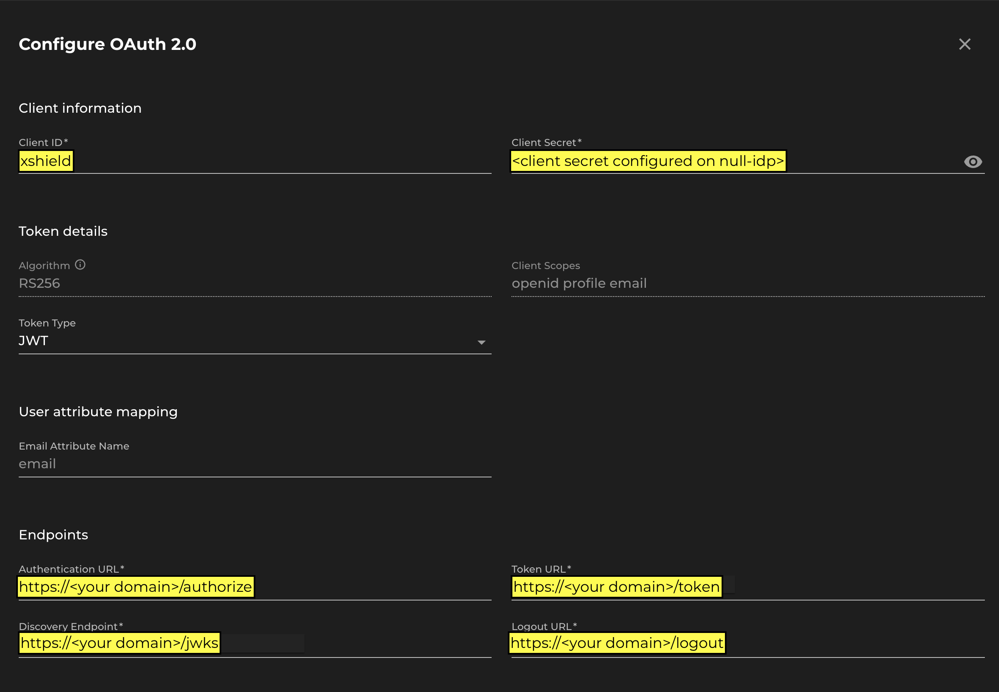

# Null Oauth Authorization Server

This is an Oauth2 server that will authenticate anyone, no questions asked.  I wrote this
to test and demonstrate single-sign-on for the Xshield portal without requiring an actual IdP.

## Installation

The instructions below are for deployment on a stock Ubuntu 22.04 server, with updates applied.

Clone tnis repo to /home/ubuntu/null-idp

    git clone https://github.com/ColorTokens-Labs/null_oauth_server.git /home/ubuntu/null-idp
    cd /home/ubuntu/null-idp

Create a virtual environment and install the required python packages:

    python3 -m venv .venv
    source .venv/bin/activate
    pip install -r requirements.txt

Create a .env file in /home/ubuntu.  Change XS_DOMAIN if you are not in the North American zone

    IDP_DOMAIN="<your FQDN (https)>"
    XS_DOMAIN="https://ng.colortokens.com"
    XS_CLIENT_SECRET="<your secret here>"

Create a directory for logging:

    sudo mkdir /var/log/null-idp
    sudo chown ubuntu:ubuntu /var/log/null-idp

Update the paths of the SSL key and cert files in gunicorn.conf.py

    ...
    18 # SSL key and cert for your domain
    19 keyfile = "./null-idp.key"
    20 certfile = "./null-idp.crt"

Copy the systemd startup script, enable it and start the service:

    sudo cp systemd/null-idp.service /etc/systemd/system
    sudo systemctl enable null-idp.service
    sudo systemctl start null-idp.service

__*NOTE*__: Open port 5000/tcp on your firewall to allow inbound traffic from the Xshield portal

## Xshield Configuration

Configure Oauth 2.0 in Xshield as shown below:

    
